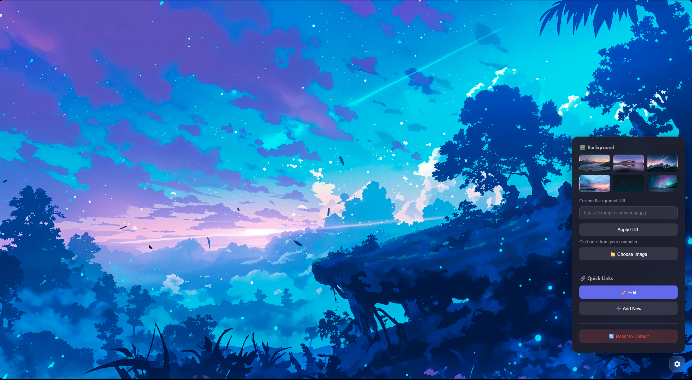

# Clean New Tab

A minimal, customizable new tab extension for Microsoft Edge and Google Chrome that replaces the default new tab page with a clean, distraction-free interface.

<p align="center">
  
  <br>
  <em>Clean, minimal interface with quick links</em>
</p>

<p align="center">
  
  <br>
  <em>Customizable backgrounds and quick links management</em>
</p>

## ✨ Features

- **🖼️ Custom Backgrounds** - Choose from preset backgrounds or upload your own (supports up to 8K resolution)
- **🔗 Quick Links** - Add, edit, and remove shortcuts to your favorite websites
- **🎨 Minimal Design** - Clean, modern interface with beautiful animations
- **💾 Persistent Storage** - All settings are saved locally
- **🔒 Privacy Focused** - No data collection, everything stays on your device

## 📦 Installation

### Quick Install (Recommended)

1. **[Download the latest release](https://github.com/tungcorn/clean-new-tab/releases/latest/download/clean-new-tab-v1.0.0.zip)**
2. Extract the ZIP file
3. Open your browser's extension page:
   - **Edge**: `edge://extensions`
   - **Chrome**: `chrome://extensions`
4. Enable **Developer mode** (toggle in top right)
5. Click **Load unpacked** and select the extracted folder
6. Open a new tab and enjoy!

### From Source (For Developers)

1. Clone this repository:
   ```bash
   git clone https://github.com/tungcorn/clean-new-tab.git
   ```

2. Follow steps 3-6 above

## 🎮 Usage

### Changing Background
1. Click the ⚙️ settings icon (bottom right)
2. Choose a preset background or:
   - Enter a custom URL and click **Apply URL**
   - Click **📁 Choose Image** to upload from your computer

### Managing Quick Links
1. Click the ⚙️ settings icon
2. Click **✏️ Edit** to enable edit mode
3. Click the × on any link to delete it
4. Click **➕ Add New** to add a new link
5. Click **✅ Done** when finished

### Reset to Default
Click **🔄 Reset to Default** to restore original settings

## 🗂️ Project Structure

```
clean-new-tab/
├── manifest.json     # Extension manifest
├── newtab.html       # New tab page HTML
├── app.js            # Main application logic
├── styles.css        # Styling
├── screenshots/      # README images
└── README.md         # This file
```

## 🛠️ Technical Details

- **Manifest Version**: 3
- **Storage**: Uses `chrome.storage.local` with `unlimitedStorage` permission for high-resolution images
- **Compatibility**: Microsoft Edge, Google Chrome, and other Chromium-based browsers

## 📄 License

MIT License - see [LICENSE](LICENSE) file for details.

## 🤝 Contributing

Contributions are welcome! Feel free to:
- Report bugs
- Suggest new features
- Submit pull requests

## 📝 Changelog

### v1.0.0
- Initial release
- Custom background support (URL and local files)
- Quick links management
- Edit mode for easy link removal
- Responsive design

---

Made with ❤️ for a cleaner browsing experience
